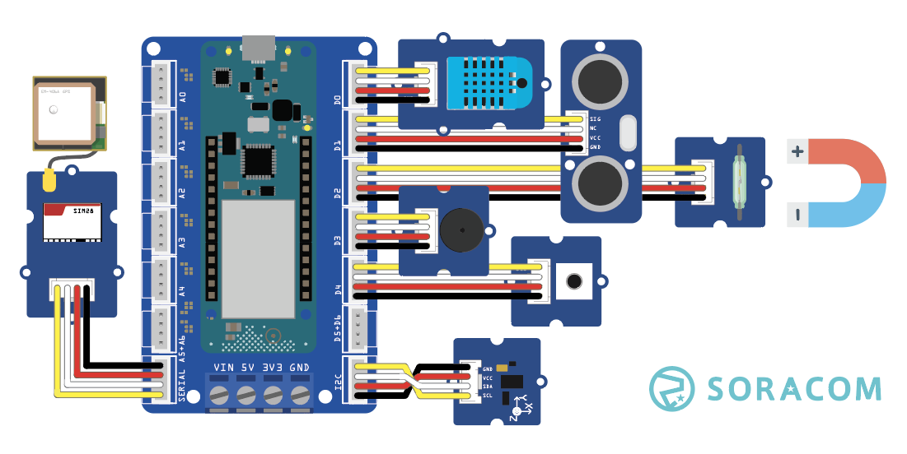
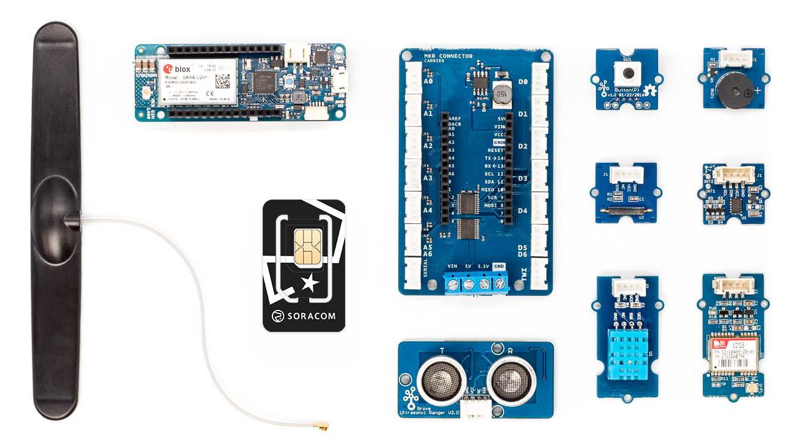
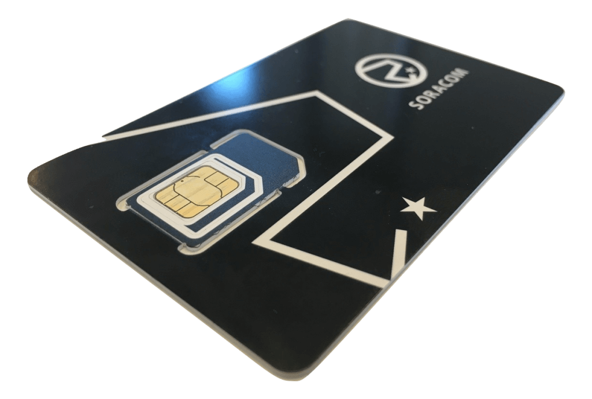
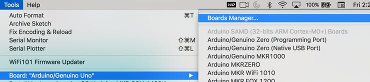
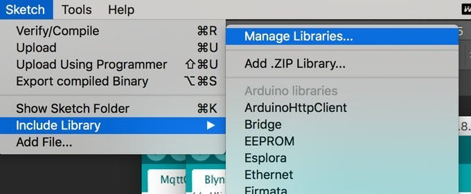

# Soracom IoT Starter Kit

The Soracom IoT Starter Kit includes everything you need to build your first connected device. It includes an [Arduino MKR GSM 1400](https://www.soracom.io/store/soracom-arduino-1400-starter-kit/) or an [Arduino MKR NB 1500](https://www.soracom.io/store/soracom-arduino-1500-starter-kit/) development board.
Using the Soracom.io network and cloud platform, you can get your device connected and publishing data to a dashboard within minutes. 

# Table of Contents
- [Getting Started](#getting-started)
- [Soracom Cloud Examples](./soracom-cloud-examples/)
  - [Arduino MKR GSM 1400 Examples](./soracom-cloud-examples/arduino-mkr-gsm-1400/)
    - [send-data-to-soracom-harvest](soracom-cloud-examples/arduino-mkr-gsm-1400/send-data-to-soracom-harvest/)
    - [soracom-unified-grove](soracom-cloud-examples/arduino-mkr-gsm-1400/soracom-unified-grove/)
  - [Arduino MKR NB 1500 Examples](./soracom-cloud-examples/arduino-mkr-nb-1500/)
    - [send-data-to-soracom-harvest](soracom-cloud-examples/arduino-mkr-nb-1500/send-data-to-soracom-harvest/)
    - [soracom-unified-grove](soracom-cloud-examples/arduino-mkr-nb-1500/soracom-unified-grove/)
- [Grove Sensor Examples](./grove-sensor-examples/)
  - [grove-accelerometer](./grove-sensor-examples/grove-accelerometer/)
  - [grove-button](./grove-sensor-examples/grove-button/)
  - [grove-buzzer](./grove-sensor-examples/grove-buzzer/)
  - [grove-dht](grove-sensor-examples/grove-dht/)
  - [grove-gps](./grove-sensor-examples/grove-gps/)
  - [grove-magnetic](./grove-sensor-examples/grove-magnetic/)
  - [grove-rangefinder](./grove-sensor-examples/grove-rangefinder/)
  - [power-mangement](./grove-sensor-examples/power-management/)

# Getting Started
- [Soracom IoT Starter Kit](#soracom-iot-starter-kit)
- [Table of Contents](#table-of-contents)
- [Getting Started](#getting-started)
  - [Register Soracom Air SIM](#register-soracom-air-sim)
  - [Download the Arduino IDE](#download-the-arduino-ide)
  - [Install Board dependancies](#install-board-dependancies)
  - [Install libraries](#install-libraries)
    - [Cellular Modem Support](#cellular-modem-support)
    - [Grove Sensor Libraries](#grove-sensor-libraries)
- [Hello world!](#hello-world)

## Register Soracom Air SIM 

Your kit includes a Soracom.io Air SIM card. This is how your device connects to the Soracom network. To register and activate your SIM card, follow the instructions in the Soracom Developers Documentation. 

https://developers.soracom.io/en/docs/air/registration/

## Download the Arduino IDE

The starter kit is programmed using the Arduino IDE, an open-source development environment that supports a variety of hardware development boards.
You can download it from the official Arduino website. 
https://www.arduino.cc/en/software

## Install Board dependancies 

To program the Arduino MKR GSM 1400 or MKR NB 1500 you'll need to install support for [Arduino SAMD Boards](https://github.com/arduino/ArduinoCore-samd).

1. Open the Arduino IDE
2. Go to **Tools** > **Board** > **Boards Manager**.
3. Search "Arduino SAMD Boards" and choose **Install**.

## Install libraries

To install libraries:

1. Open the Arduino IDE
2. Go to **Sketch** > **Manage Libraries**.
3. Use the search bar to find and install the libraries listed below. 

### Cellular Modem Support

Install the library that corresponds to your device. 

- Arduino MKR GSM 1400 [MKRGSM](https://github.com/arduino-libraries/MKRGSM)
- Arduino MKR NB 1500 [MKRNB](https://github.com/arduino-libraries/MKRNB)

### Grove Sensor Libraries

- [ADXL345](https://github.com/Seeed-Studio/Accelerometer_ADXL345)
- [Bounce2](https://www.arduino.cc/reference/en/libraries/bounce2/)
- [DHT](https://github.com/Seeed-Studio/Grove_Temperature_And_Humidity_Sensor)
- [PMIC](https://github.com/arduino-libraries/Arduino_BQ24195)
- [Ultrasonic](https://github.com/Seeed-Studio/Seeed_Arduino_UltrasonicRanger)
- [Wire](https://github.com/arduino/ArduinoCore-avr/tree/master/libraries/Wire)
  
# Hello world!

Try programming this basic sketch to your device. In depth instructions are provided as well. 

[Hello world example](./soracom-cloud-examples/arduino-mkr-gsm-1400/hello-world/README.md)
