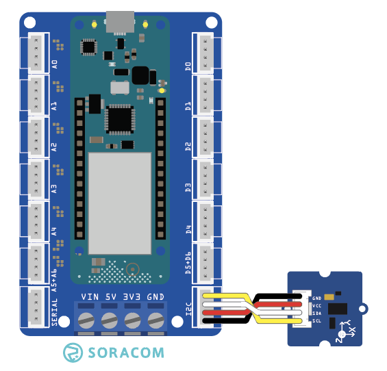

copyright 2021 (c) Soracom

MIT Licence

# Grove Accelerometer (ADXL345)
This sketch will read data from the Grove Accelerometer (ADXL345) using the Arduino MKR Connector TWI port.  Output from the sensor will be dumped to the Serial port on the IDE.



Additional information on the Grove sensor devices is available online at [Accelerometer_ADXL345](https://github.com/Seeed-Studio/Accelerometer_ADXL345).

## Required Arduino Libraries:

- [Arduino](https://github.com/arduino/Arduino)
- [ADXL345](https://github.com/Seeed-Studio/Accelerometer_ADXL345)
- [Wire](https://github.com/arduino/ArduinoCore-avr/tree/master/libraries/Wire)

## Program setup

### Getting started

1. Install the ADXL345 device into TWI slot on the Arduino MKR Connector Carrier board
1. Make the USB connection between the Arduino MKR 1400 your Arduino IDE (PC)
1. Use the Arduino IDE to verify and upload the Arduino image to the MKR GPS 1400, you may need to install additional libraries from the IDE (CTRL SHIFT I) to verify and upload the sketch.
1. Start the serial monitor, the serial connection speed is set by `#define SERIAL_SPEED 9600` at 9600 bps
1. The ADXL345 object will emit readings in the X, Y & Z axis, moving & rotating the device will change the readings

Please note;
- The timerExpired function has limited accuracy and is expected to drift over time.

### Digital Ports

|Grove Port	    |Connector	|Digital PIN|
|---------------|-----------|-----------|
|TWI            |1 Yellow	| 11	SDA |
|		        |2 White    | 12	SCL |
|		        |3 Red      | 5V0       |
|		        |4 Black	| Ground    |

## Console output at the Serial port
The sketch will wait for the IDE to attach to the Serial port before it starts taking readings and sending output.

```text
16:03:46.752 ->
16:03:46.752 -> ADXL345 starting..
16:03:47.780 -> Force X:-53 Y:10 Z:244
16:03:48.775 -> Force X:-53 Y:11 Z:244
16:03:49.770 -> Force X:-51 Y:10 Z:243
16:03:50.766 -> Force X:-52 Y:10 Z:243
16:03:51.761 -> Force X:-54 Y:10 Z:243
16:03:51.761 -> Acceleration X:-0.2032506000 Y:0.0376009000 Z:0.8487139500
16:03:52.756 -> Force X:-52 Y:9 Z:244
16:03:53.784 -> Force X:-52 Y:8 Z:243
16:03:54.779 -> Force X:-53 Y:8 Z:243
16:03:55.774 -> Force X:-53 Y:9 Z:242
16:03:56.769 -> Force X:-52 Y:9 Z:245
16:03:56.769 -> Acceleration X:-0.1957228000 Y:0.0338408100 Z:0.8556992500
16:03:57.763 -> Force X:-53 Y:10 Z:244
16:03:58.757 -> Force X:-52 Y:10 Z:245
16:03:59.786 -> Force X:-53 Y:10 Z:245
16:04:00.781 -> Force X:-52 Y:10 Z:242
16:04:01.776 -> Force X:-51 Y:9 Z:245
16:04:01.776 -> Acceleration X:-0.1919589000 Y:0.0338408100 Z:0.8556992500
16:04:02.772 -> Force X:-52 Y:9 Z:244
16:04:03.767 -> Force X:-53 Y:10 Z:244
```

## Code Cuts
- Attach your code to the sensor `ADXL345 sensor;`
- Power on the sensor device `sensor.powerOn();`
- Read data from the sensor, data is provided for the X, Y & Z directions `sensor.readXYZ(&x, &y, &z);`

### Static Variable
The content (value) of a 'static' variable persists, for example value of 'tsStart' in function timerExpired() persists between calls to the function, the value of the variable is initialized the first time the function is called and retains its setting between calls.

```c
	static unsigned long tsStart = millis();
```

### Using FLASH memory for static data
The 'F("STRING")' construct places static data into flash storage, preserving RAM for your code.

```c
	Serial.println(F("ADXL345 starting.."));
```
