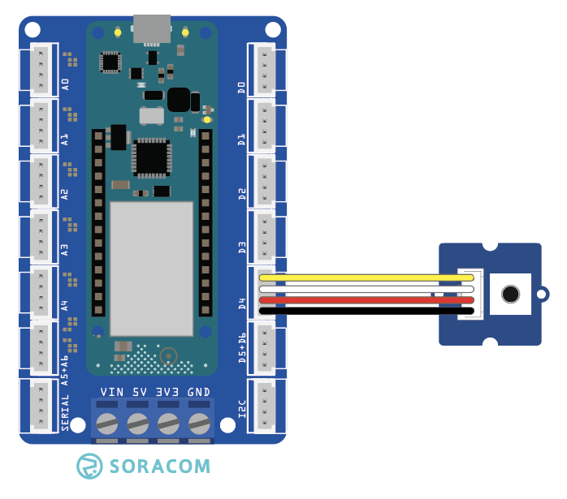

copyright 2021 (c) Soracom

MIT Licence

# Grove Button
This sketch will read data from the Grove Button using the Arduino MKR Connector at D4 (Digital Pin 4 in the IDE).  Output from the sensor will be dumped to the Serial port on the IDE.



Additional information on the Grove sensor device is available online at [Grove - Button](https://wiki.seeedstudio.com/Grove-Button/).

## Required Arduino Libraries:

- [Arduino](https://github.com/arduino/Arduino)
- [Bounce2](https://www.arduino.cc/reference/en/libraries/bounce2/)

## Program setup

### Getting started

1. Install the Grove Button device into D4 slot on the Arduino MKR Connector Carrier board, this is set in the sketch by `#define BTN_INPUT 4`
1. Make the USB connection between the Arduino MKR 1400 your Arduino IDE (PC)
1. Use the Arduino IDE to verify and upload the Arduino image to the MKR GPS 1400, you may need to install additional libraries from the IDE (CTRL SHIFT I) to verify and upload the sketch.
1. Start the serial monitor, the serial connection speed is set in the running sketch by `#define SERIAL_SPEED 9600` at 9600 bps, serial speed in the IDE should be set to the same.
1. The Grove Button object will emit readings when the Serial connection is made and the Grove Button is pressed & released.

Please note;
- The Grove Button has a 10k0 pull down resistor installed on the Grove module, the switch (button) is normally open and will show in the IDE as Logic State LOW, when the button is pressed the Logic State will go HIGH.
- The Button2 class will detect two transitions for each button press; the first when the button is pressed and the second when it is released.
- The timerExpired function has limited accuracy and is expected to drift over time.

### Digital Ports

|Grove Port	|Connector	|Digital PIN|
|---------------|-----------|-----------|
| D4    |1 Yellow	| 4 |
|		|2 White    | not connected  |
|		|3 Red      | 5V0       |
|		|4 Black	| Ground    |

## Console output at the Serial port
The sketch will wait for the IDE to attach to the Serial port, output is triggered by your interaction with the Grove Button.

```text
16:06:37.928 ->
16:06:37.928 -> Starting btn test..
16:06:38.923 -> ......BTN Update [1] : PRESSED
16:06:44.800 -> BTN State : 1
16:06:44.933 -> .BTN Update [2] : NOT PRESSED
16:06:45.099 -> BTN State : 0
16:06:45.929 -> .BTN Update [3] : PRESSED
16:06:46.393 -> BTN State : 1
16:06:46.725 -> BTN Update [4] : NOT PRESSED
16:06:46.725 -> BTN State : 0
16:06:46.925 -> ...........
```

## Code Cuts
- Attach your code to the sensor Grove Button `btn.attach(BTN_INPUT, INPUT);`
- Within the `loop()` function in the sketch, the button object is updated by calling `btn.update();`
- Test if the button has been activated `btn.changed()` and read the new state `btn.read()`

### Static Variable
The content (value) of a 'static' variable persists, for example value of 'tsStart' in function timerExpired() persists between calls to the function, the value of the variable is initialized the first time the function is called and retains its setting between calls.

```c
	static unsigned long tsStart = millis();
```

### Using FLASH memory for static data
The 'F("STRING")' construct places static data into flash storage, preserving RAM for your code.

```c
	Serial.println(F("ADXL345 starting.."));
```
