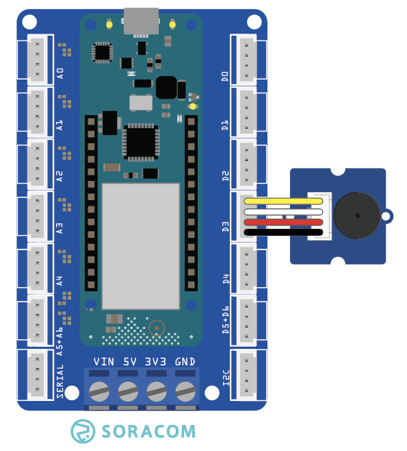

copyright 2021 (c) Soracom

MIT Licence

# Grove Buzzer
This sketch will send data (Logic State) to the Grove Buzzer using the Arduino MKR Connector D3 (Digital Pin 3 in the IDE).  Output from the sensor will be sound!



Additional information on the Grove sensor device is available online at [Grove-Buzzer](https://wiki.seeedstudio.com/Grove-Buzzer/).

## Required Arduino Libraries:

- [Arduino](https://github.com/arduino/Arduino)

## Program setup

### Getting started

1. Install the Grove Buzzer device into D3 slot on the Arduino MKR Connector Carrier board, this is set in the sketch by `#define BZR_PIN 3`
1. Make the USB connection between the Arduino MKR 1400 your Arduino IDE (PC)
1. Use the Arduino IDE to verify and upload the Arduino image to the MKR GPS 1400, you may need to install additional libraries from the IDE (CTRL SHIFT I) to verify and upload the sketch.
1. Start the serial monitor, the serial connection speed is set in the running sketch by `#define SERIAL_SPEED 9600` at 9600 bps, serial speed in the IDE should be set to the same.
1. The Grove Buzzer object will emit sound after the IDE Serial port has connected to the running sketch.

Please note;
- The code will cycle the Logic Level on Digital Pin 3 between HIGH and LOW each second, the buzzer will sound one second ON, and one second OFF.
- The timerExpired function has limited accuracy and is expected to drift over time.

### Digital Ports

|Grove Port	|Connector	|Digital PIN|
|---------------|-----------|-----------|
| D3            |1 Yellow	| D3 |
|		|2 White    | not connected |
|		|3 Red      | 5V0       |
|		|4 Black	| Ground    |

## Console output at the Serial port
The sketch will wait for the IDE to attach to the Serial port

```text
Starting buzzer..............
```

## Code Cuts
- Attach your code to the Grove Buzzer device `pinMode(BZR_PIN, OUTPUT);`
- Switch the Logic State of the Digital PIN to LOW (silent) `digitalWrite(BZR_PIN, LOW);`
- In the loop() function, change the Logic State of the Digital PIN every second `digitalWrite(BZR_PIN, !digitalRead(BZR_PIN));`

### Static Variable
The content (value) of a 'static' variable persists, for example value of 'tsStart' in function timerExpired() persists between calls to the function, the value of the variable is initialized the first time the function is called and retains its setting between calls.

```c
	static unsigned long tsStart = millis();
```

### Using FLASH memory for static data
The 'F("STRING")' construct places static data into flash storage, preserving RAM for your code.

```c
	Serial.println(F("Starting buzzer.."));
```
