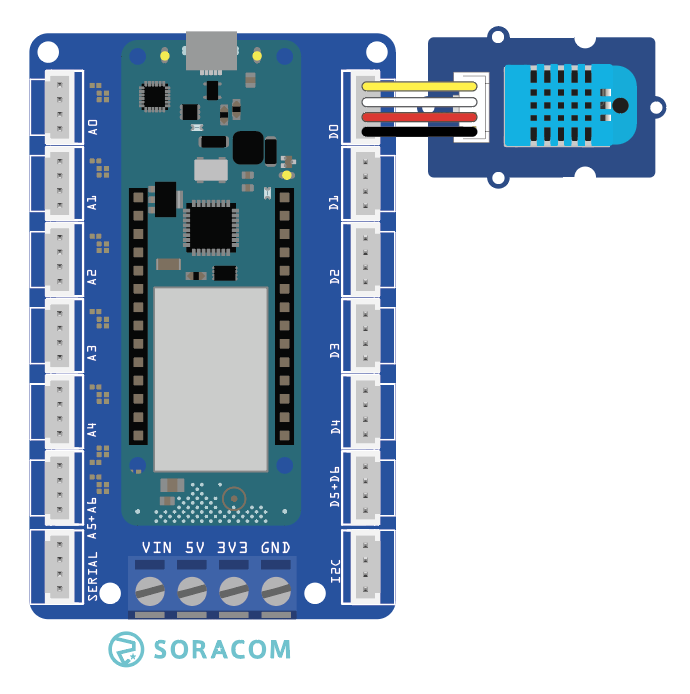

copyright 2021 (c) Soracom

MIT Licence

# Grove DHT Sensor
This sketch will read data from the Grove DHT Sensor using the Arduino MKR Connector D0 (Digital Pin 0 in the IDE).  Output from the sensor will be dumped to the Serial port on the IDE.



Additional information on the Grove sensor device is available online at [Grove Temperature and Humidity Sensor](https://github.com/Seeed-Studio/Grove_Temperature_And_Humidity_Sensor).

## Required Arduino Libraries:

- [Arduino](https://github.com/arduino/Arduino)
- [DHT](https://github.com/Seeed-Studio/Grove_Temperature_And_Humidity_Sensor)
- [Wire](https://github.com/arduino/ArduinoCore-avr/tree/master/libraries/Wire)

## Program setup

### Getting started

1. Install the Grove DHT Sensor device into D0 slot on the Arduino MKR Connector Carrier board, this is set in the sketch by `#define DHTPIN 0`
1. Make the USB connection between the Arduino MKR 1400 your Arduino IDE (PC)
1. Use the Arduino IDE to verify and upload the Arduino image to the MKR GPS 1400, you may need to install additional libraries from the IDE (CTRL SHIFT I) to verify and upload the sketch.
1. Start the serial monitor, the serial connection speed is set in the running sketch by `#define SERIAL_SPEED 9600` at 9600 bps, serial speed in the IDE should be set to the same.
1. The Grove DHT Sensor object will emit readings for Temperature & Humidity after a connection to the IDE Serial port has been established.

Please note;
- The timerExpired function has limited accuracy and is expected to drift over time.

### Digital Ports

|Grove Port	|Connector	|Digital PIN|
|---------------|-----------|-----------|
| D0            |1 Yellow	| 0 |
|		|2 White    | not connected |
|		|3 Red      | 5V0       |
|		|4 Black	| Ground    |

## Console output at the Serial port
The sketch will wait for the IDE to attach to the Serial port

```text
Starting the DHT11_Grove sensor...
```

## Code Cuts
- Attach your code to the Grove DHT Sensor `DHT groveSensor(DHTPIN, DHTTYPE);`
- Power on the data bus `Wire.begin(DHTPIN);` and start the sensor `groveSensor.begin();`
- Read data from the sensor, `float cTemp = groveSensor.readTemperature(false);`

### Static Variable
The content (value) of a 'static' variable persists, for example value of 'tsStart' in function timerExpired() persists between calls to the function, the value of the variable is initialized the first time the function is called and retains its setting between calls.

```c
	static unsigned long tsStart = millis();
```

### Using FLASH memory for static data
The 'F("STRING")' construct places static data into flash storage, preserving RAM for your code.

```c
	Serial.println(F("Starting the DHT11_Grove sensor"));
```
