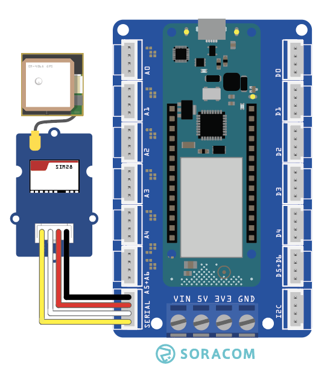

copyright 2021 (c) Soracom

MIT Licence

# Grove GPS Sensor
This sketch will read data from the Grove GPS Sensor using the Arduino MKR Connector Serial port.  Output from the sensor will be dumped to the Serial port on the IDE.

 Grove GPS Sensor

Additional information on the Grove sensor device is available online at [Grove GPS Sensor](https://www.seeedstudio.com/Grove-GPS-Module.html).

## Required Arduino Libraries:

- [Arduino](https://github.com/arduino/Arduino)

## Program setup

### Getting started

1. Install the Grove GPS Sensor device into Serial slot on the Arduino MKR Connector Carrier board.
1. Make the USB connection between the Arduino MKR 1400 your Arduino IDE (PC)
1. Use the Arduino IDE to verify and upload the Arduino image to the MKR GPS 1400, you may need to install additional libraries from the IDE (CTRL SHIFT I) to verify and upload the sketch.
1. Start the serial monitor, the serial connection speed is set in the running sketch by `#define SERIAL_SPEED 9600` at 9600 bps, serial speed in the IDE should be set to the same.
1. The GPS device attached through the Serial port will emit data every second.

```nmea
$GPGSA  : Used to represent the ID’s of satellites which are used for position fix.
$GPGSV  : Satellite information about elevation, azimuth and CNR
$GPRMC  : Time, date, position, course and speed data.
$GPGGA  : Time, position, and fix related data of the receiver
```

Please note;
- Additional features for the GPS sensor data are available using external software modules, for example TinyGSP.
- The timerExpired function has limited accuracy and is expected to drift over time.

### Digital Ports

|Grove Port	|Connector	|Digital PIN|
|---------------|-----------|-----------|
| Serial        |1 Yellow	| TX|
|		        |2 White    | RX|
|		        |3 Red      | 5V0       |
|		        |4 Black	| Ground    |

## Console output at the Serial port
The sketch will wait for the IDE to attach to the Serial port

```text
    Starting SIM28 test..
    $GPGGA,000324.799,,,,,0,0,,,M,,M,,*4A
    $GPGSA,A,1,,,,,,,,,,,,,,,*1E
    $GPGSV,1,1,00*79
    $GPRMC,000324.799,V,,,,,0.00,0.00,060180,,,N*40
```

## Code Cuts
- Attach your code to the Grove GPS Sensor serial port `Serial1.begin(9600);`
- Read data from the sensor, `Serial1.read();`
- Push data to the Serial port attached to the IDE `Serial.write(buffer, count);`

### Static Variable
The content (value) of a 'static' variable persists, for example value of 'tsStart' in function timerExpired() persists between calls to the function, the value of the variable is initialized the first time the function is called and retains its setting between calls.

```c
	static unsigned long tsStart = millis();
```

### Using FLASH memory for static data
The 'F("STRING")' construct places static data into flash storage, preserving RAM for your code.

```c
	Serial.println(F("Starting SIM28 test.."));
```
