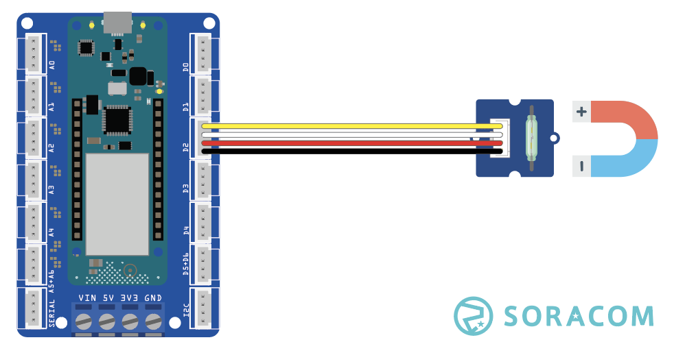

copyright 2021 (c) Soracom

MIT Licence

# Grove Magnetic Reed-Switch
This sketch will read data from the Grove Reed-Switch using the Arduino MKR Connector D2 (Digital Pin 2 in the IDE).  Output from the sensor will be dumped to the Serial port on the IDE, moving a magnet into close proximity to the Reed-Switch will change the output.



Additional information on the Grove sensor device is available online at [Grove Reed-Switch](https://wiki.seeedstudio.com/Grove-Magnetic_Switch/).

## Required Arduino Libraries:

- [Arduino](https://github.com/arduino/Arduino)
- [Bounce2](https://github.com/thomasfredericks/Bounce2)

## Program setup

### Getting started

1. Install the Grove Reed-Switch sensor into D2 slot on the Arduino MKR Connector Carrier board, this is set in the sketch by `#define REED_INPUT 2`
1. Make the USB connection between the Arduino MKR 1400 your Arduino IDE (PC)
1. Use the Arduino IDE to verify and upload the Arduino image to the MKR GPS 1400, you may need to install additional libraries from the IDE (CTRL SHIFT I) to verify and upload the sketch.
1. Start the serial monitor, the serial connection speed is set in the running sketch by `#define SERIAL_SPEED 9600` at 9600 bps, serial speed in the IDE should be set to the same.
1. The Grove Reed-Switch object will emit readings after the connection from the IDE to Serial port has been established.

Please note;
- The Button2 class will detect two transitions for each pass of the magnet; the first when the magnet arrives and the second when it is removed.
- The Grove Reed-Switch has a 10k0 pull down resistor installed on the Grove module, when the switch is open it will show in the IDE as Logic State LOW, when the button is closed the Logic State will go HIGH.
- The timerExpired function has limited accuracy and is expected to drift over time.

### Digital Ports

|Grove Port	|Connector	|Digital PIN|
|---------------|-----------|-----------|
| D2            |1 Yellow	| 2 |
|		|2 White    | not connected |
|		|3 Red      | 5V0       |
|		|4 Black	| Ground    |

## Console output at the Serial port
The sketch will wait for the IDE to attach to the Serial port

```text
17:07:16.885 ->
17:07:16.885 -> Starting reed switch test..
17:07:17.881 -> ...............BTN Update [1] : MAGNET
17:07:32.460 -> BTN State : 1
17:07:32.560 -> BTN Update [2] : NO MAGNET
17:07:32.560 -> BTN State : 0
17:07:32.892 -> ......BTN Update [3] : MAGNET
17:07:38.007 -> BTN State : 1
17:07:38.173 -> BTN Update [4] : NO MAGNET
17:07:38.173 -> BTN State : 0
17:07:38.206 -> BTN Update [5] : MAGNET
17:07:38.206 -> BTN State : 1
17:07:38.272 -> BTN Update [6] : NO MAGNET
17:07:38.272 -> BTN State : 0
17:07:38.903 -> ...........
```

## Code Cuts
- Attach your code to the Grove Rangefinder `reedSwitch.attach(REED_INPUT, INPUT);`
- Read Logic State from the sensor, `reedSwitch.read()`

### Static Variable
The content (value) of a 'static' variable persists, for example value of 'tsStart' in function timerExpired() persists between calls to the function, the value of the variable is initialized the first time the function is called and retains its setting between calls.

```c
	static unsigned long tsStart = millis();
```

### Using FLASH memory for static data
The 'F("STRING")' construct places static data into flash storage, preserving RAM for your code.

```c
	Serial.println(F("Starting reed switch.."));
```
