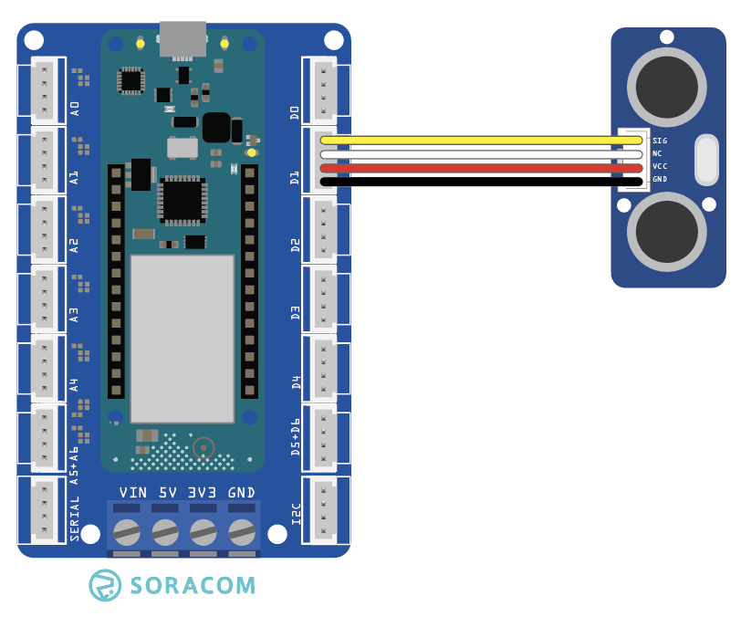

copyright 2021 (c) Soracom

MIT Licence

# Grove Rangefinder
This sketch will read data from the Grove Rangefinder using the Arduino MKR Connector D1 (Digital Pin 1 in the IDE).  Output from the sensor will be dumped to the Serial port on the IDE, moving a target around in front of the Rangefinder will change the output.



Additional information on the Grove sensor device is available online at [Grove Rangefinder](https://wiki.seeedstudio.com/Grove-Ultrasonic_Ranger/).

## Required Arduino Libraries:

- [Arduino](https://github.com/arduino/Arduino)
- [Ultrasonic](https://github.com/Seeed-Studio/Seeed_Arduino_UltrasonicRanger)

## Program setup

### Getting started

1. Install the Grove Rangefinder device into D1 slot on the Arduino MKR Connector Carrier board, this is set in the sketch by `#define USRF_PIN 1`
1. Make the USB connection between the Arduino MKR 1400 your Arduino IDE (PC)
1. Use the Arduino IDE to verify and upload the Arduino image to the MKR GPS 1400, you may need to install additional libraries from the IDE (CTRL SHIFT I) to verify and upload the sketch.
1. Start the serial monitor, the serial connection speed is set in the running sketch by `#define SERIAL_SPEED 9600` at 9600 bps, serial speed in the IDE should be set to the same.
1. The Grove Rangefinder object will emit readings for range to target after the IDE Serial port has been established.

Please note;
- The timerExpired function has limited accuracy and is expected to drift over time.

### Digital Ports

|Grove Port	|Connector	|Digital PIN|
|---------------|-----------|-----------|
| D1            |1 Yellow	| 1 |
|		|2 White    | not connected |
|		|3 Red      | 5V0       |
|		|4 Black	| Ground    |

## Console output at the Serial port
The sketch will wait for the IDE to attach to the Serial port

```text
    Starting the ultrasonic Rangefinder..
    Range to target : 57 CM
    Range to target : 20 CM
    Range to target : 18 CM
```

## Code Cuts
- Attach your code to the Grove Rangefinder `Ultrasonic usrf(USRF_PIN);`
- Read data from the sensor, `rangeToTarget = usrf.MeasureInCentimeters()`

### Static Variable
The content (value) of a 'static' variable persists, for example value of 'tsStart' in function timerExpired() persists between calls to the function, the value of the variable is initialized the first time the function is called and retains its setting between calls.

```c
	static unsigned long tsStart = millis();
```

### Using FLASH memory for static data
The 'F("STRING")' construct places static data into flash storage, preserving RAM for your code.

```c
	Serial.println(F("Starting the DHT11_Grove sensor"));
```
