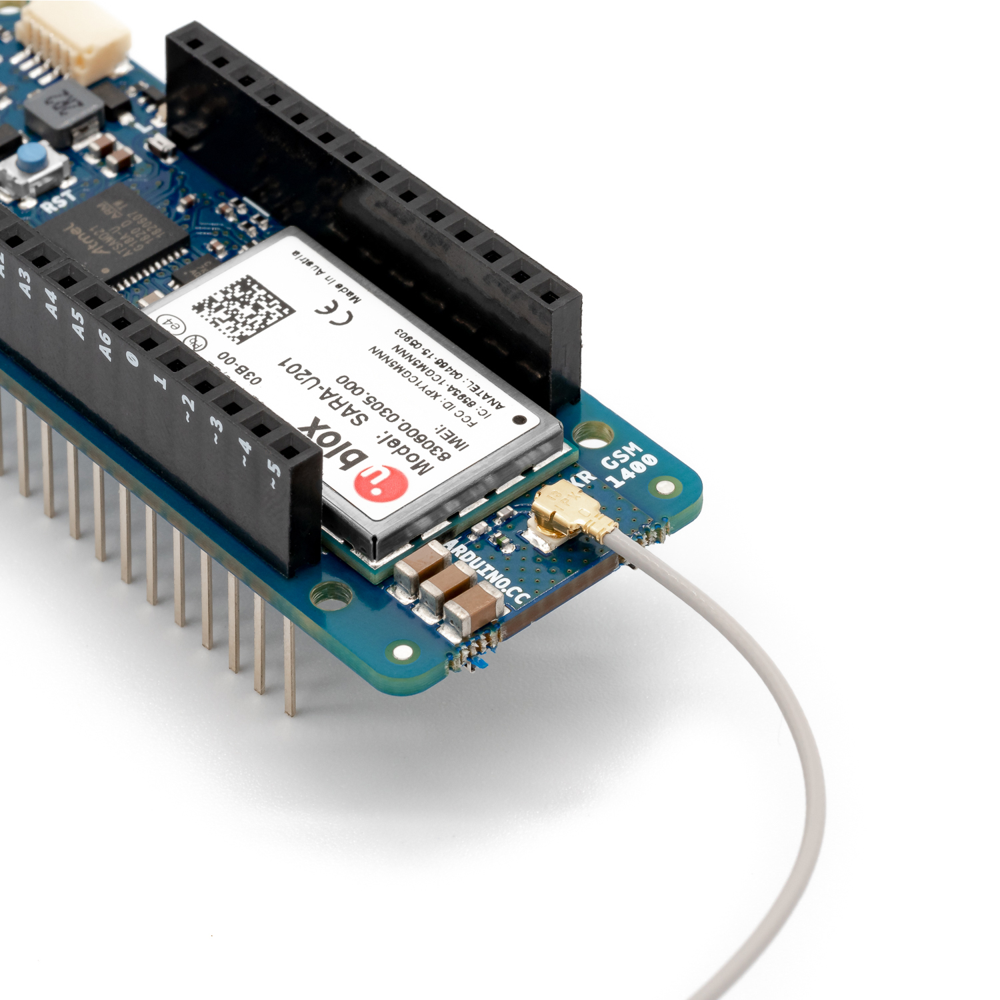

copyright 2021 (c) Soracom

MIT Licence

# hlwWorld code example
To run hlwWorld demo sketch you will need to Download & install the the Arduino IDE, connect & Power the MKR GSM 1400 module and load & run the hloWorld sketch.



A good reference for the Arduino MKR 1400 is online at
[ARDUINO MKR GSM 1400](https://www.tme.eu/Document/00e2e442e11233ad78ec4808c9124d43/ABX00018_MKR%20GSM%201400.pdf)

## Arduino IDE & Libraries:
- [Arduino IDE](https://www.arduino.cc/en/Guide)


- [Arduino](https://github.com/arduino/Arduino)
- [MKRGSM](https://github.com/arduino-libraries/MKRGSM)

## Program setup

### Install the the Arduino IDE
1. Download the Arduino IDE.  The Arduino IDE is freely available for Linux, MAC & Windows from [www.arduino.cc](https://www.arduino.cc/en/Guide), pick the correct install kit for your operating system, download and install.  Once installed open the IDE and if prompted update to the current version.
1. `IDE : Tools -> Board -> Boards Manager`  Once installed add the MKR GSM 1400 board into your development environment.
1. `IDE : Tools -> Manage Library`  Also add 'MKR GSM 1400' library to your IDE.  In the search field on the library manager add 'MKR GSM 1400' and install 'Arduino SAMD Boards (32-bits ARM Cortex-Mo+)'.
1. `IDE : Tools -> Manage Library`  Add the MKRGSM library to your IDE.  In the search field on the library manager add 'MKRGSM' and install the library of the same name.
1. `IDE : Tools -> Board -> ` Add the library to the build configuration in the IDE, select 'MKR GSM 1400'. `Arduino SAMD (32 bit ARM Cortex M0+) -> Arduino MKR GSM 1400`
1. `IDE : Tools -> Port -> /dev/ttyACM0 (Arduino MKR GSM 1400)` Check that the USB connection between the Arduino MKR 1400 your PC is in place.  To enable serial communication with the board select the correct USB Serial Port from Tools -> Port.  On a Linux platform the prompt includes `/dev/ttyACM0`, this may look different for other platforms.

### Building the hloWorld sketch
1. `IDE : File -> New` Create a new sketch
1. `IDE : File -> Save as` Save the new sketch to a file, Overwrite the default sketch name with 'hello-world'
1. `IDE : Sketch -> Include Library` The MKRGSM functions are exposed through an Arduino library. You will need to include the `MKRGSM` library into your sketch. In the Include library interface search for MKRGSM and select.  When you return to the IDE and your code you should see that an include statement has been added to the file (`#include <MKRGSM.h>`)
1. Copy & Paste the code from `setup()` and `loop()` into your IDE.  When run the hloWorld sketch will write text to the serial port on the IDE and flash one of the LEDs on the module.
1. `IDE : Sketch -> Verify/Compile`  Check the code for errors and compile

### Run and Debug the code
1. `IDE : Sketch -> Upload`  Upload the code into flash memory on the MKR GSM 1400, the device will reboot and you sketch will run when the upload is finished
1. `IDE : Tools -> Serial Monitor` Connect to the serial port on MKR GSM 1400 and observe serial output from the sketch.  On the new window check that the connection speed is a match for the connection speed in your sketch.  Bottom Right Hand side second pulldown should be set to 9600.

### Please note;
- LED_BUILTIN will flash while the code is running.  LED_BUILTIN is the ORANGE LED close to the I2C interface and on the same side of the MKR module as the GREEN power LED.
- The MKR GSM 1400 module has been provided with an antenna, this should be connected to the board at the first opportunity, the antenna should be in place when the GSM radio is activated and will improve wireless signal levels and may also help to reduce the power requirement to the radio hardware.
- Have a care when connecting hardware to Pins on your MKR GSM 1400.  Review the power requirement for the new device against the ratings for the pin(s) and the power budget for the whole configuration.  If you get this wrong; Best case, you sketch will not work, worst case you will damage one of both of the devices.  Spec's, drawings and PIN maps for the MKR GSM 1400 are online at the Arduino site.  PIN's on the MKR GSM 1400 are limited to 3.3 volts and maximum current of 7 mA.  If you exceed these values you are likely to damage the board.
- Your USB PSU (Power Supply) should be rated for at least 2A, the GSM radio transmitter when operating requires high current.  Installing a fully charged LiPo battery into the BATT port on the MKR GSM 1400 can help to mitigate demand on the USB Power source.

## Console output at the Serial port
The sketch will wait for 60 seconds for the IDE to attach to the Serial port.  After the 60 second timeout the sketch will continue.  LED_BUILTIN is also used to show progress through the test.

```text
16:51:46.784 ->
16:51:46.784 -> Hello World!
16:51:46.784 -> ...............................
```

## LED_BUILTIN
- OFF; waiting for a Serial connection from the IDE.
- FLASHING; the IDE Serial port was connected and the sketch is running

## Code Cuts
- Set the line speed for the Serial connection to the IDE `Serial.begin(SERIAL_SPEED);`
- Set the LED to ON/OFF `digitalWrite(LED_BUILTIN, !digitalRead(LED_BUILTIN));`

### Logical NOT
The sketch uses the LOGICAL NOT construct (`!`) in the code, this is used to change the state of the LED.  A Logical NOT inverts a logic value, true becomes false and false becomes true.  The `digitalRead()` function returns the Logical State of the Digital Pin defined in the first argument, in the code we invert (NOT) the returned value and write it back to the same Digital Pin.  ON becomes OFF, OFF becomes ON.

We do the same at the start of the sketch to detect when the IDE is connected to the Serial port.  `Serial` will return a Logical TRUE if a Serial connection to the IDE has been established, in our code we wait for that connection before allowing the sketch to run.

```c
	while (!Serial)
    	delay(1000);
```
### Static Variable
The content (value) of a 'static' variable persists, for example value of 'tsStart' in function timerExpired() persists between calls to the function, the value of the variable is initialized the first time the function is called and retains its setting between calls.

```c
	static unsigned long timeStamp = millis();
```

### Using FLASH memory for static data
The 'F("STRING")' construct places static data into flash storage, preserving RAM for your code.

```c
	Serial.println(F("Hello World!"))
```
