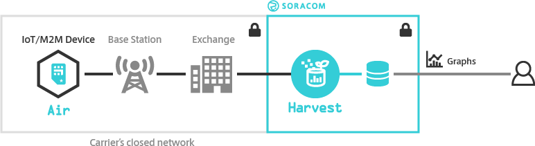

copyright 2021 (c) Soracom

MIT Licence

# Soracom Harvest
This sketch will send data from the Arduino GSM 1400 over the wireless network.  Output from the will be passed to the Soracom cloud and can be seen in the Harvest section of the Soracom Console GUI.



- Additional information on Soracom Harvest is available online at [Soracom Harvest](https://developers.soracom.io/en/docs/harvest/).
- Access to the Soracom console is at [Soracom Console](https://console.soracom.io).

## Required Arduino Libraries:

- [Arduino](https://github.com/arduino/Arduino)
- [MKRGSM](https://github.com/arduino-libraries/MKRGSM)

## Program setup

### Getting started

1. Install a Soracom SIM card into the SIM slot on the underside of the Arduino MKR GSM module.
1. Connect the GSM Antenna to the module.
1. Make the USB connection between the Arduino MKR 1400 your Arduino IDE (PC).
1. Use the Arduino IDE to verify and upload the Arduino sketch to the MKR GPS 1400, you may need to install additional libraries from the IDE (CTRL SHIFT I) to verify and upload the sketch.
1. Start the serial monitor, the serial connection speed is set by `#define SERIAL_SPEED 9600` at 9600 bps
1. The sketch will send one message to the Harvest Service and then sleep.

Please note;
- Your USB PSU (Power Supply) should be rated for at least 2A, the GSM radio transmitter when operating requires high current.
- LED_BUILTIN will light for the time it takes to send data over the network to the network interface for Soracom HARVEST.  LED_BUILTIN is the ORANGE LED close to the I2C interface and on the same side of the MKR module as the GREEN power LED.
- A modem reset can take up to 10 seconds and may delay output on the Serial console.
- The timerExpired function has limited accuracy and is expected to drift over time.

## Console output at the Serial port
The sketch will wait for 60 seconds for the IDE to attach to the Serial port.  After the 60 second timeout the sketch will continue.  LED_BUILTIN is also used to show progress through the test.

```text
17:16:06.587 ->
17:16:06.587 -> Starting Soracom HARVEST test..
17:16:06.587 -> Starting Modem, GSM, GPRS and Soracom Cloud connection
17:16:19.276 -> 	[1/4] GSM_READY  Modem IMEI : 357520078534019 SIM ICCID : 8942310019001627660
17:16:23.657 -> 	[2/4] GPRS_READY
17:16:25.448 -> 	[3/4] Soracom Cloud connection ready
17:16:25.448 -> .	[4/4] Sending message to Soracom Harvest
17:16:27.140 -> Soracom Cloud connection is UP, sending '{"A":10,"B":11,"C":12}', timeout is : 1000
17:16:28.236 -> HTTP/1.1 201 Created
17:16:28.236 -> Date: Fri, 22 Jan 2021 17:16:28 GMT
17:16:28.236 -> Connection: close
17:16:28.236 -> Content-Length: 0
17:16:28.236 ->
```
The text starting `HTTP/1.1 201 Created` is the reply from the Harvest WEB Server http interface.

## LED_BUILTIN
- ON(Flash); - Startup, awaiting Serial connection from the Arduino IDE.  This will timeout after 60 seconds.
- OFF; Connecting to the GSM & GPRS network.
- On; Connected to Soracom Cloud & sending data
- OFF; Finished.

## Code Cuts
- Attach to the GSM & GPRS networks `gsmAccess.begin(PINNUMBER, true, true);`  `gprs.attachGPRS(GPRS_APN, GPRS_LOGIN, GPRS_PASSWORD, true);`
- Connect to Soracom Harvest `client.connect(HARVEST_SERVER, HARVEST_PORT)`
- Begin sending data to the Soracom cloud interface `client.println(F("POST / HTTP/1.1"));`

### Wait for IDE connection with timeout
```c
  for(int loopCount = 0; loopCount <= 60; loopCount++)
      while (!Serial) {
          delay(1000);
      }
```
### Using FLASH memory for static data
The 'F("STRING")' construct places static data into flash storage, preserving RAM for your code.

```c
	Serial.println(F("Starting Soracom HARVEST test.. "));
```
