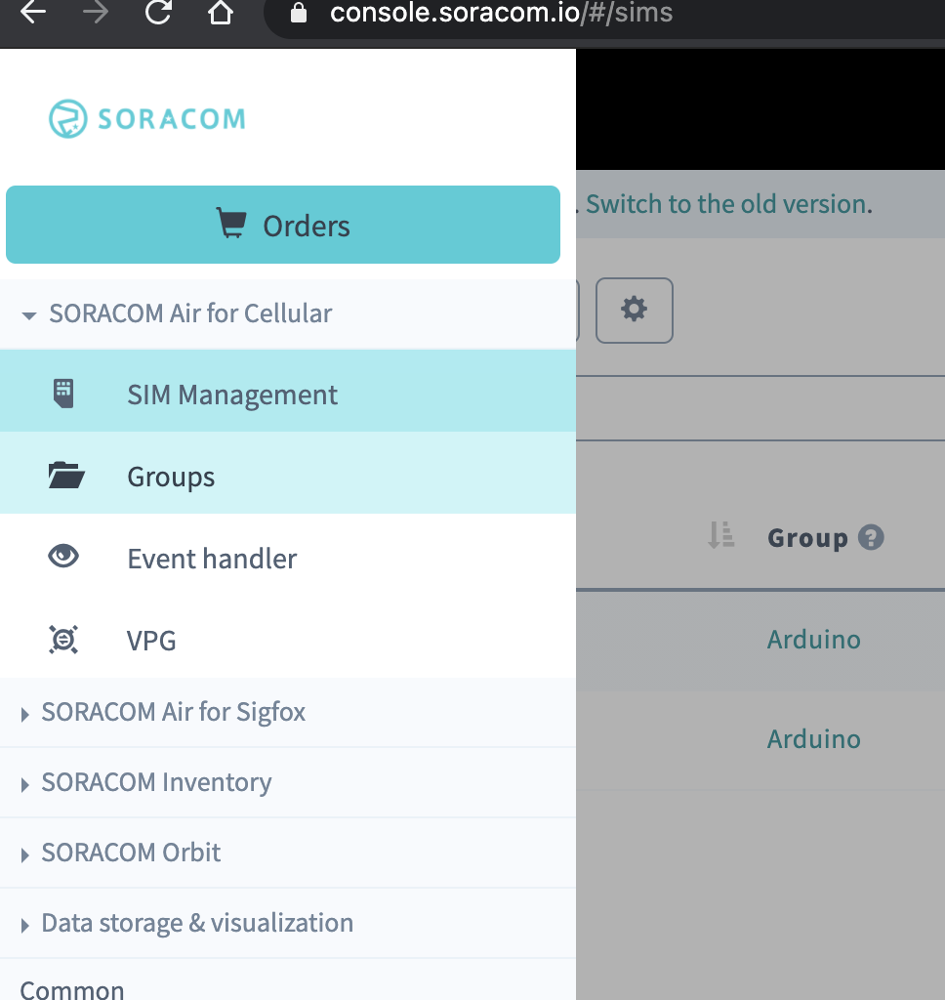
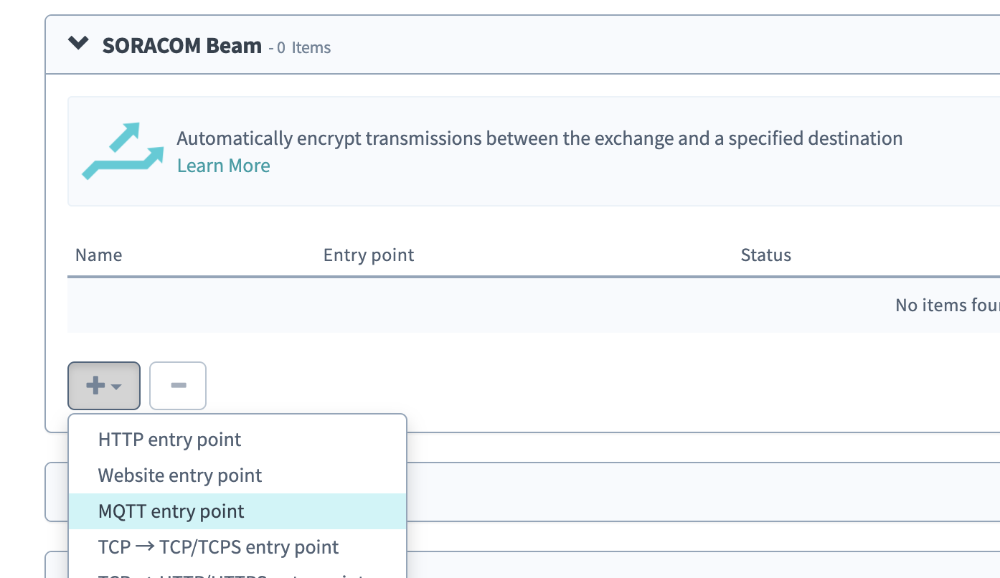
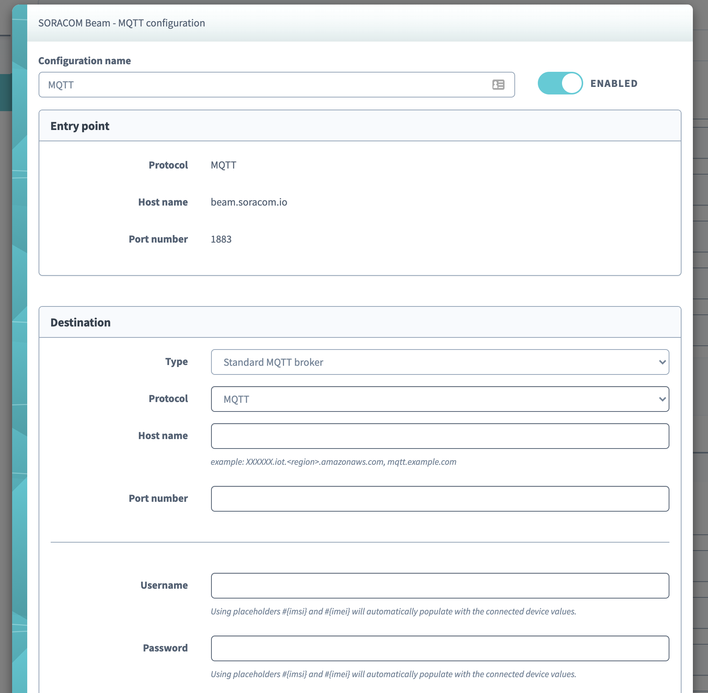

#Soracom Beam MQTT


###Use less data, get more control

For low-power, low-memory devices, every bit counts.
[SORACOM Beam[(https://www.soracom.io/products/beam/)] reduces data and power needs related to encryption, allows connection to your cloud without relay servers or SDKs, and supports certificate management for your entire IoT/M2M fleet.

- Reduce power, bandwidth and memory use
- Connect securely to your cloud of choice
- Manage credentials at scale

For example, you can configure a basic MQTT entry point on Soracom Beam that your device can connect to using built in SIM credentials. Then Soracom Beam can connect to Adafruit.io, AWS IoT, Azure IoT, and so forth using secure credentials stored in the cloud.


The example sketch in this folder connects to Soracom Beam and publishes a sensor value to a topic every 10 seconds. It also subscribes to a topic and listens for an ```on``` or ```off``` command to toggle the LED on pin 6. 

Before using it you must configure a Soracom Beam MQTT entry point.


# Table of Contents
- [Table of Contents](#table-of-contents)
  - [Configure Soracom Beam](#configure-soracom-beam)
  - [Program Sketch](#program-sketch)


## Configure Soracom Beam

1. Sign into the [Soracom Console](https://console.soracom.io/).
2. Choose **Groups** from the menu.

3. Choose an existing group or create one. If you havent already, add your device's SIM to a group. 
4. Create a new **Soracom Beam MQTT entry point**.

5. Configure the entry point as neccesary for your cloud integration. Once saved, your Soracom Beam MQTT entry point live.


## Program Sketch

This part is easy! Install the required libraries and flash the sketch as is! Then open the Arduino Serial Monitor set to 115200 baud. 

- Arduino MKR NB 1500 [MKRNB](https://github.com/arduino-libraries/MKRNB)
- [ArduinoMQTTClient](https://github.com/arduino-libraries/ArduinoMqttClient)